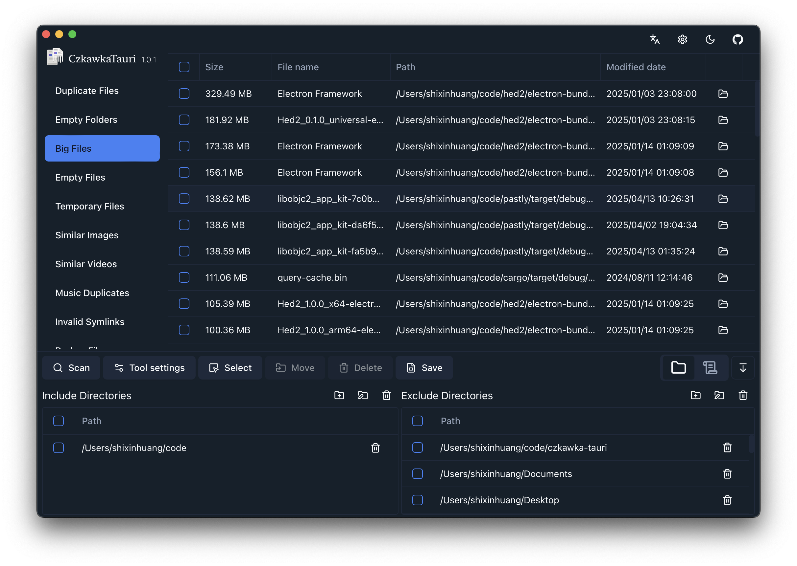

## CzkawkaTauri

A Tauri frontend of [Czkawka](https://github.com/qarmin/czkawka) on macOS and Windows.




### Installation

- [Download latest release](https://github.com/shixinhuang99/czkawka-tauri/releases)

- Homebrew

```bash
brew tap shixinhuang99/brew
brew install --cask czkawka-tauri
# or
brew install --cask czkawka-tauri-ffmpeg
```

### Differences with Krokiet:

- Use full paths for paths.
- Use decimal for file sizes.
- The default scan directory is the user directory.
- When deleting files, they are moved to the recycle bin by default.

### Note

- On macOS, Some directories controlled by system permissions are excluded by default. If necessary, please click the Add button to open Finder, select the desired directory, and remove it from the excluded directories. This should allow the system to remember the accessible directories(known issue: macOS may forget about accessible directories after installing a new version, you need to reset the settings and repeat the above actions).
- Versions with the ffmpeg suffix in the release are bundled with the ffmpeg binary.

### Development

requirements:

- rust stable
- node 22
- pnpm

packages required for Linux (Ubuntu 24.04 for instance):

see [Tauri Doc](https://tauri.app/start/prerequisites/#linux)

```sh
sudo apt install libglib2.0-dev \
  libgtk-3-dev \
  libsoup-3.0-dev \
  libjavascriptcoregtk-4.1-dev \
  libwebkit2gtk-4.1-dev \
  libxdo-dev
```

run:

```sh
pnpm i
cargo build
node --run run
```

format and lint

```sh
just fmt
just check
```
